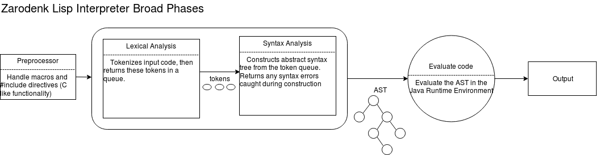

# Zarodenk_Lisp  

A Lisp interpreter for our custom LISP dialect, built in Java and running on the JVM.  Final project for Mr. Brown's APCS class, second semester. The dialect will include a few unusual features, such as the ability to include other files and define macros as preprocessor directives.  The initial implementation will be minimalist and based upon John McCarthy's classic paper "A Micro-Manual for LISP - Not the whole truth," a copy of which has been provided in this repository.  We will then slowly add features on an experimental branch and push to the master branch when they are stable.  Our implementation of LISP will utilize some of the datastructures and algorithms we have learned throughout the semester, namely queues and trees.  More will be added here in the next few weeks.

## Functionality
### Data Types
* `Number`- initially these will be integers, but floating points will be added eventually  
* `String`- stored in java's native `String` type  
* `Boolean`- with `T` for true and `NIL` for false  

### Data Structures
* `List`- constructed using cons, stored as a `LinkedList` in Java  
* `atom`- stores one primitive datatype  

### Functions
Initially, the following predefined functions will be availible to users of Zarodenk Lisp. These definitions are paraphrased from the John McCarthy paper mentioned above.
* `(quote e)` evaluates to `e`.  
* `(car l)` evaluates to the first element in non-empty list `l`.  
* `(cdr l)` evaluates to the list `l` without its first element.  
* `(cons l1 l2)` evaluates to the list that is the result of prefixing the lists `l1` and `l2` together.  
* `(equal e1 e2)` evaluates to `T` if expression `e1` is equal to expression `e2`. The expression evaluates to `NIL` otherwise.  
* `(atom e)` evaluates to `T` if the expression.  
* `(cond (pi ei) .. (pn en))` evaluates to value ei where pi is the first of the p's whose value is NOT `NIL` (or `T`).  
* `((lambda (vi ... vn) e) ei ... en)` evaluates to `e`, where the variables `vi ... vn` take the values of expressions `ei ... en`.  
* `((label f (lamda (vi ... vn) e)) ei ... en) evaluates to the same as `((lambda (vi ... vn) e) ei ... en)`, except that when `(f ai ... an)` is invoked, it is replaced with (label f (lambda (vi ... vn) e)). This allows for recursive functionality.  
* `(print v)` will print the value `v` to the console.  
* `(defun f (vi ... vn)) e)` will be used to permentantly defines function `f` so it can be reused.  
* `(def s v)` will define the variable `s` as value `v`.  
* `(list ei ... en)` evaluates to `(cons ei(cons ... (cons en nil)))`.  
* `(and p q)` evaluates to `T` if `p` and `q` both evaluate to `T`, otherwise evaluates to `NIL`.  
* `(or p q)` evaluates to `T` if either `p` or `q` are true, otherwise evaluates to `NIL`.  
* `(not p)` evaluates to `T` if `p` is `NIL`, and `NIL` if `p` is `T`.  
* `(operation ei ... en)` evaluates to (in infix) `ei operation ... operation en`, where the e's are `numbers`, and `operation` is an arithmetic operation (+, -, *, /, %).  
* `(comparator ei ... en)` evaluates to (in infix) `ei comparator ... comparator en`, where the 's are `numbers`, and `comparator` is a numerical comparator (=, >, <, >=, <=, !=).  

### Misc.
* As with most LISP dialects, Zarodenk Lisp is dynamically typed  
* Recursion will be added after the other core functionality is implemented, as it's significantly more complex to implement.
* "Short circuit" functionality will be availible with `and` statements
* `NIL` is the name of the empty list `()`

## Interpreter

### Preprocessor  
Any files that are included using the `#include "filename"` directive will be copied directly into the string passed to the lexer in order.  The `#macro "find" "replace"` directive will replace all instances of the find string with the replace string.  These features will be added much later, as they are secondary to our primary goal, which is getting a working interpreter up and running.

### Lexer (Lexical Analysis)
The lexer will take the raw LISP code and turn it into a queue of tokens to be read by the parser.  It will accomplish this via the following steps:
1. Read file as a `String`  
2. add whitespace around `(` and `)`  
3. Use scanner to split resulting string on whitespace (except in the case of `Strings`, which should be kept together), and pass all non-whitespace `Strings` to Tokens  
4. Tokens will determine type by using regular expressions (RegEx), and be added in order to a queue of tokens.  A list of Token types has been listed below.  
   * `LPAREN`- `(`  
   * `RPAREN`- `)`  
   * `SYM`- `a`  
   * `STR`- `"a"`  
   * `NUM`- `1` (floating points to be added later)  
   * `FUNC`- `f` (preceding `LPAREN`, unless it's in a cond)  
5. The queue of tokens will be returned and subsequently fed to the parser
NOTE: conditional (`cond`) are the exception to the function rule mentioned above, as they are of the form `(cond (S-EXPR S-EXPR) (S-EXPR S-EXPR))`, where the first `S-EXPR` where the value of the expression is the value of which ever `S-EXPR` evaluates true first  

Ex:
#### Code
	(def a 3)
	(cond
	  ((> a 2)
	   (print "Big num"))
	  (T
	   (print "Small num")))
	(print "Done!")
#### Token queue returned
	Token(LPAREN,)
	Token(FUNC,)
	Token(SYM,)
	Token(NUM,)
	Token(RPAREN,)
	Token(LPAREN,)
	Token(FUNC,)
	Token(LPAREN,)
	Token(LPAREN,)
	Token(FUNC,)
	Token(SYM,)
	Token(NUM,)
	Token(FUNC,)
	Token(STR,)
	Token(RPAREN,)
	Token(RPAREN,)
	Token(LPAREN,)
	Token(SYM,)
	Token(LPAREN,)
	Token(FUNC,)
	Token(STR,)
	Token(RPAREN,)
	Token(RPAREN,)
	Token(RPAREN,)
	Token(LPAREN,)
	Token(FUNC,)
	Token(STR,)
	Token(RPAREN,)

### Parser (Syntactical and Semantic Analysis)
Turns token queue into an abstract syntax tree (AST).  **TO BE WRITTEN**
